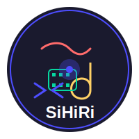

# SiHiRi: Creative OS

<p align="center">
  
</p>

> A decentralized open-sourced creative ecosystem built on Clarity and Web3, empowering artists, filmmakers, musicians, game developers, and the broader creative industry.

## Core Vision

SiHiRi is not just a platform — it's a **Creative Operating System** for creation, collaboration, distribution, royalties, and preservation of art in all forms:

- Built with **Clarity smart contracts**, decentralized storage, and modular updates
- A hub where creativity meets AI co-creation, DAOs, NFTs, gamification, and cultural preservation
- A single marketplace where every brushstroke, beat, 3D model, film frame, or shader is not just uploaded — it's alive

We aim to achieve this through a phased approach over the next decade, focusing on:

<!-- Milestone Roadmap section header -->

** ## Milestone Roadmap

### Phase 1: Foundations

- Deploy Clarity contracts for identity, ownership, and royalties
- Build NFT primitives with dynamic metadata (supporting art, music, film, 3D)
- Create a creator wallet & dashboard (onboarding, minting, managing works)
- Integrate decentralized storage (IPFS, Arweave)
- Launch basic marketplace for artists with instant payments and fixed royalties
- Open GitHub repo + community docs → encourage open-source collaboration

### Phase 2: Growth & Interoperability

- Build cross-chain bridges (Ethereum, Cardano)
- Release SDKs & plugins for Design Apps, Blender, Figma, Unity, Unreal
- Introduce token-gated communities for private exhibitions or fan clubs
- Add dynamic royalty contracts (royalties based on context of use)
- Launch mobile-first creative hub with discovery feeds
- Begin DAO for governance (voting, funding proposals, disputes)
- Enable micro-patronage & tipping systems

### Phase 3: AI + Co-Creation

- Develop AI Creative Co-Pilot (style suggestions, plagiarism detection, collaborator matching)
- Enable AI-assisted minting (generative art, music, scriptwriting) with clear proof of authorship
- Add gamified ecosystem layer (XP, badges, leaderboards, seasonal creative challenges)
- Integrate decentralized archives for permanent cultural preservation
- Onboard educational modules → workshops, mentorship, tutorials

### Phase 4: The Creative Civilization

- Power metaverse-native experiences (festivals, exhibitions, VR concerts)
- Build immersive collaboration suites (like Blender/Adobe, but Web3-native)
- Launch cultural preservation DAO for Indigenous and global art forms
- Introduce eco-credit tracking system for sustainable creativity
- Expand SiHiRi into a UNESCO-level cultural commons – the backbone of digital art, film, and music preservation worldwide
- Foster global partnerships with art institutions, studios, and educational bodies


<!-- Milestone Roadmap section header -->

## Development Principles

- **Artist-first** → creators own their work, their royalties, and their audience
- **Open Source** → transparent, community-driven, forkable
- **Interoperable** → works anywhere across Web2 & Web3
- **Inclusive** → onboarding for underrepresented artists globally
- **Future-proof** → AI-assisted, modular, decentralized forever

## The SiHiRi Ecosystem

We are building a digital economy where:

- 🎨 Artists mint layers of creativity (designs, textures, models, music, storyboards, etc) as building blocks
- 🎮 Game studios plug into this open library to source characters, worlds, and mechanics — with royalties flowing back to creators forever
- 🎥 Filmmakers commission renders, animations, and VFX from a global pool of render-nodes and collaborators, paid instantly in STX
- 🖼 Collectors don't just buy art, they own the provenance of entire creative chains — who modeled the character, who textured it, who rigged it, who directed the scene
- ⚡ Fans subscribe to artists and studios directly, co-own works-in-progress, and unlock scenes as living NFTs
- 🏛 Curators and galleries run DAOs to showcase, fund, and archive cultural works on Bitcoin

This isn't a static NFT marketplace. It's a creative operating system:

- Built on Clarity smart contracts (royalties, provenance, collaboration splits)
- Powered by decentralized render jobs (escrow + attestations)
- Linked through IPFS/Arweave archives (no asset ever disappears)
- Governed by creators themselves through DAOs

## Getting Started

> Note: SiHiRi is currently in early development. This section will be updated as the project progresses.

### Prerequisites

- Node.js (v14+)
- Clarity CLI
- Docker (optional, for local development)

### Installation

```bash
# Clone the repository
git clone https://github.com/sihiri/sihiri_build.git
cd sihiri

# Install dependencies
npm install

# Set up development environment
npm run setup
```

## Contributing

We welcome contributions from developers, artists, and creative professionals of all backgrounds. Please read our [CONTRIBUTING.md](CONTRIBUTING.md) for details on our code of conduct and the process for submitting pull requests.

## License

This project is licensed under the MIT License - see the [LICENSE](LICENSE) file for details.

## Acknowledgments

All Rights Reserved to the SiHiRi Team and Contributors.

- The global creative community
- Open source blockchain projects that paved the way
- Artists and creators who inspire this vision

---

<p align="center">
  <i>SiHiRi - Where Creativity Lives Forever on Bitcoin</i>
</p>